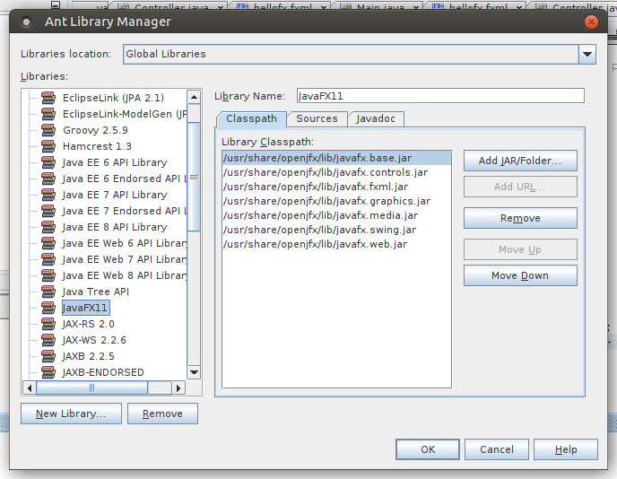
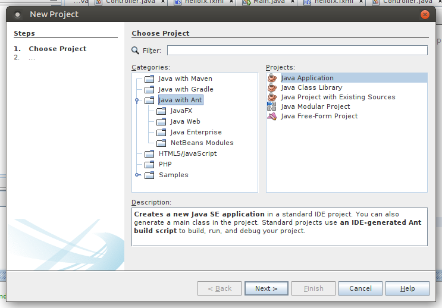
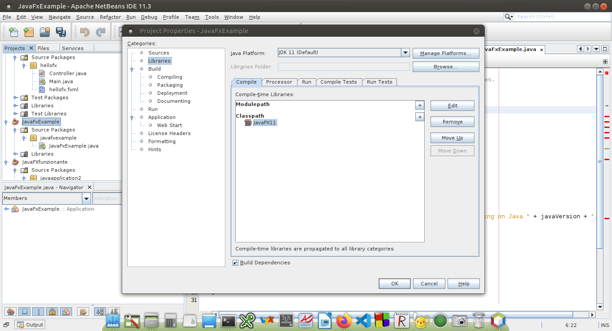
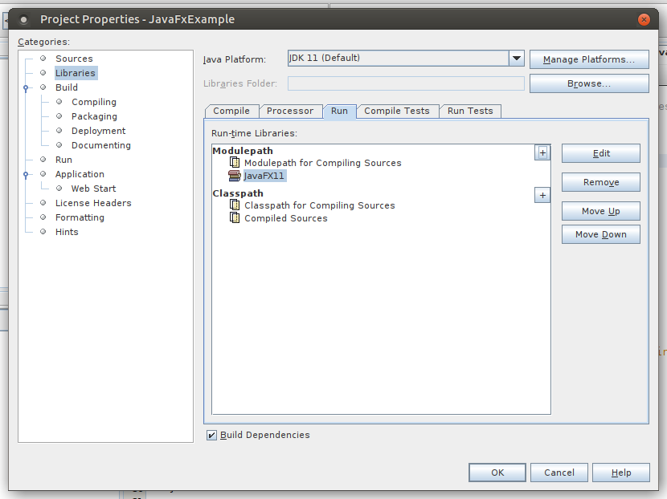
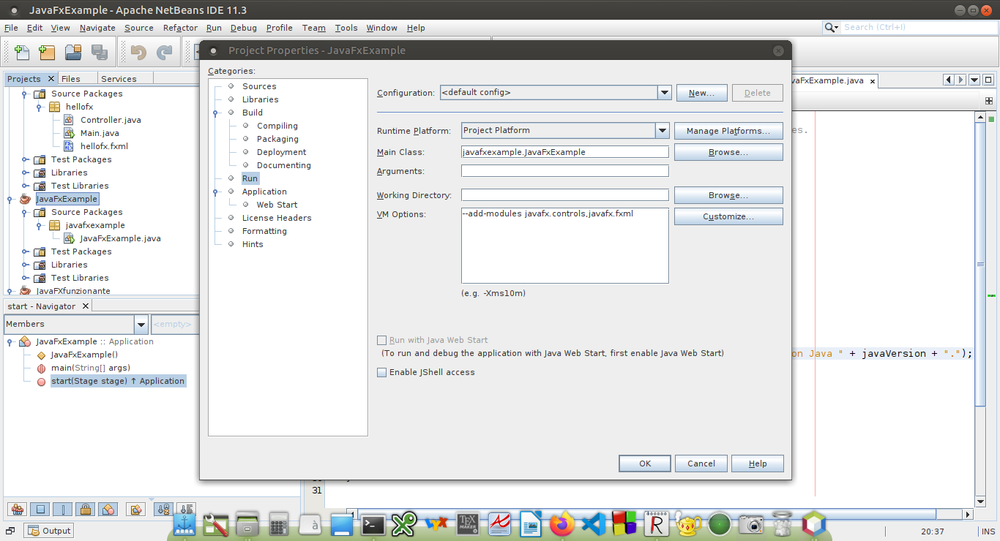

# Come far funzionare JavaFX in Linux Ubuntu 20.04 con OpenJDK 11, NetBeans 11 e JavaFX  11

* Installare OpenJDK 11 utilizzando *apt* 


    ```
    sudo apt-get install default-jdk
    ```

* Installare NetBeans 
    * **opzione 1 (più semplice)**: scaricarlo come *snap* da [Snapcraft](https://snapcraft.io/netbeans) e seguire le istruzioni
    
    * **opzione 2**: scaricarlo dal sito di [Apache NetBeans](https://netbeans.apache.org/download/nb113/nb113.html) sotto forma di [file zip](https://www.apache.org/dyn/closer.cgi/netbeans/netbeans/11.3/netbeans-11.3-bin.zip). Una volta scaricato basta estrarre il contenuto in una cartella, la scelta più ovvia è in **/opt**.
Supponendo di aver scaricato il file nella propria cartella *Downloads*, prima lo si sposterà in **/opt** con
        
        ```
        sudo mv netbeans-11.3-bin.zip /opt/
        ```
        
        e successivamente estrarlo nella stessa posizione
        
        ```
         sudo unzip netbeans-11.3-bin.zip 
        ```

        Per renderlo lanciabile da linea di comando basta aggiungere questa riga nel file **.bashrc**
        
        ```
        export PATH="$PATH:/opt/netbeans/bin/"
        ```

        Volendolo anche integrare nei menù grafici dipende da cosa si utilizza, in generale basta aggiungere un nuovo lanciatore.
A questo punto è possibile provare a vedere se tutto funziona provando a lanciare Netbeans e creando un progetto semplice.

## Come utilizzare JavaFX per costruire interfacce grafiche
A questo punto per aggiungere JavaFX non è un grosso problema. Da linea di comando si installa la libreria
```
sudo apt-get install openjfx
```
Poi può essere comodo settare un path per poter usare la libreria utilizzando comandi da shell, come indicato [qui](https://openjfx.io/openjfx-docs/#install-javafx), con la differenza che, avendola installata usando la versione pacchettizzata, il path sarà il seguente
```
export PATH_TO_FX=/usr/share/openjfx/lib
```
e questa riga dovrà essere copiata in **.bashrc** come fatto in precedenza per NetBeans.


A questo punto, per verificare se tutto ha funzionato correttamente, si possono seguire le istruzioni sempre presenti in [questa pagina](https://openjfx.io/openjfx-docs/#install-javafx) e verificare di riuscire a costruire un programma funzionante (si può ignorare la versione indicata in quella pagina e adattarla alla propria).


Per integrare l'utilizzo della libreria all'interno di NetBeans utilizzando Ant (in modo da evitare di dover poi scaricare altro) la cosa è un po' più complessa, ma se si seguono attentamente [queste istruzioni](https://openjfx.io/openjfx-docs/#IDE-NetBeans) tutto dovrebbe funzionare a dovere (dove c'è scritto 12 non preoccuparsi e sostituire con 11). Qui segue un riassunto di come è stata impostata sul mio computer:

* impostazione della libreria JavaFX: all'interno di NetBeans aprire il menù Tools->Libraries e premere il bottone New Library... e indicare come nome JafaFX11. Una volta creata la libreria aggiungere i file Jar corretti. premendo sul pulsante Add Jar/Folder, andare nella cartella */usr/share/openjfk/lib* e selezionare uno per uno i vari file *.jar* presenti nella cartella. Dopo aver ripeturo l'operazione per ogni jar ci si dovrebbe trovare in una situazione simile a questa



* a questo punto creare un nuovo progetto scegliendo JavaApplication, non JavaFX



* per settare il progetto in modo che vengano viste le librerie di JavaFX andare nelle proprietà del progetto e aggiungere la libreria creata in precedenza nel pannello *Compile*



e fare la stessa cosa nel pannello *Run*



* sostituire il codice dell'applicazione in modo che sia un codice JavaFX funzionante (un esempio già impostato si può trovare in JavaFXExample)

* infine andare ad aggiungere le impostazion ```--add-modules javafx.controls,javafx.fxml``` all'interno del pannello *VM options* che si trova nelle proprietà del progetto alla voce **Run** come si puà vedere nell'immagine qua sotto:



# Scene Builder

Infine, per poter utilizzare anche lo Scene Builder, scaricare il file *.deb* appropriato alla [pagina di Gluon](https://gluonhq.com/products/scene-builder/) e installarlo con i tool appropriati della propria distribuzione (a linea di comando con *gdebi*) e dovrebbe essere creata la cartella con l'eseguibile sempre nella cartella **/opt**.

Per l'integrazione in NetBeans si ricorda di andare in **Tools->Options->Java->JavaFX** e indicare nell'apposito box la home dello Scene Builder, che dovrebbe essere **/opt/SceneBuilder**. 

Per verificare il funzionamento provare con l'esempio JavaFXML.


 
